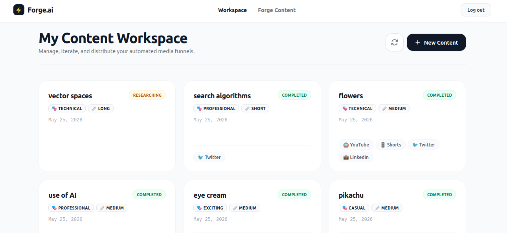
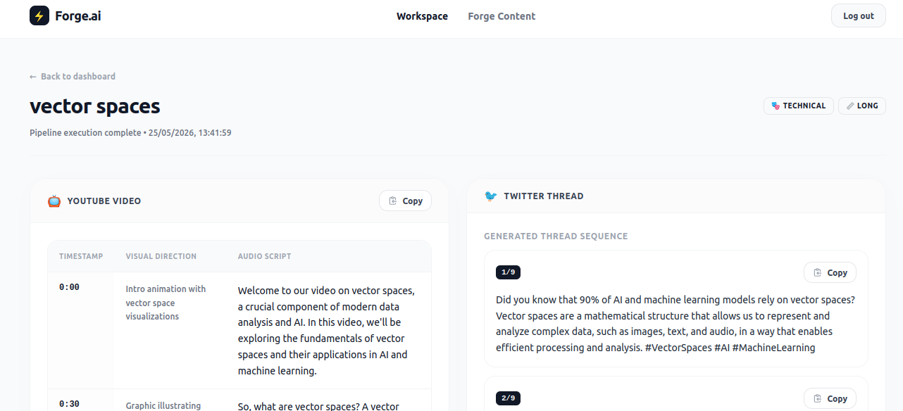
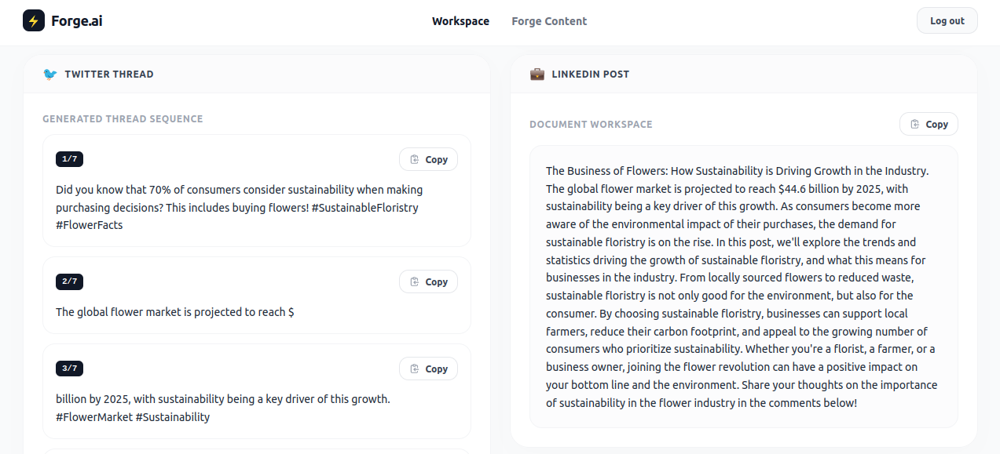
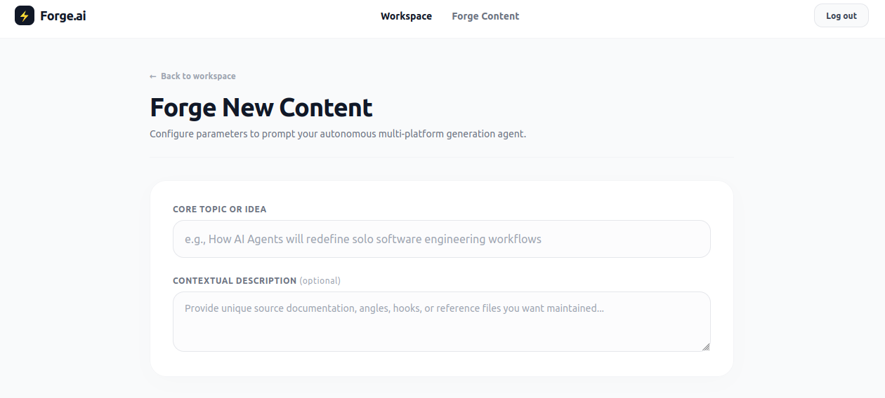
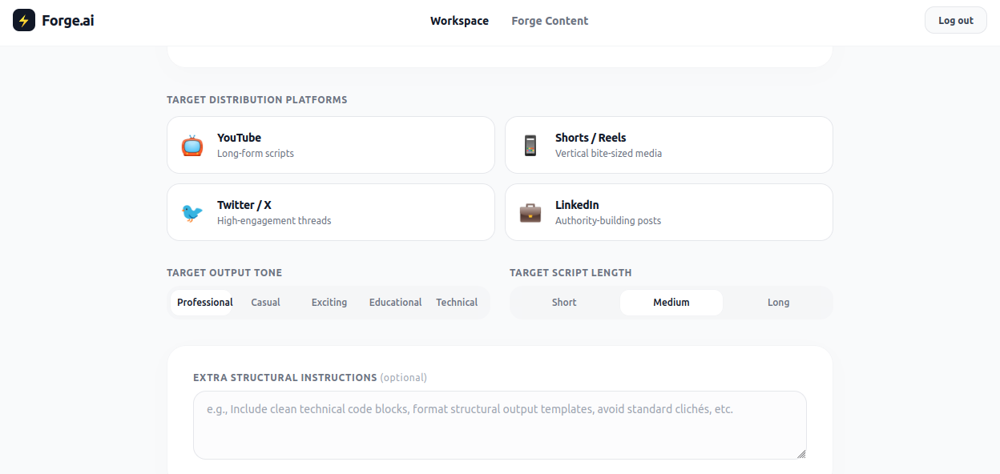

# AI Content Factory - Frontend

Modern and responsive **React** frontend for the AI Content Factory project.

Built with React, Tailwind CSS v4, and Redux.

## ✨ Features

- Clean and modern UI
- JWT Authentication (Login / Register)
- Create content for YouTube, Shorts/Reels, Twitter, and LinkedIn
- Beautiful result viewer with timestamps and structured scripts
- Copy buttons for easy sharing
- Responsive design

## Tech Stack

- **React 18**
- **Tailwind CSS v4**
- **Redux Toolkit**
- **React Router v6**
- **Axios**

## Backend Repo
https://github.com/rizwan-amir123/content_factory

## Screenshots

### 1. Dashboard


### 2. Generated Content Output



### 3. Create New Content



## Project Structure

```text
src/
├── components/       # Reusable components
├── pages/            # Main pages (Login, Dashboard, Create, BatchDetail)
├── redux/            # Redux store & slices
├── utils/            # API configuration
├── App.js
├── index.js
└── index.css
```

## Quick Start

```bash
# Clone the repository
git clone <your-frontend-repo-url>
cd content-factory-frontend

# Install dependencies
npm install

# Start development server
npm start
```

The app will run at http://localhost:3000


